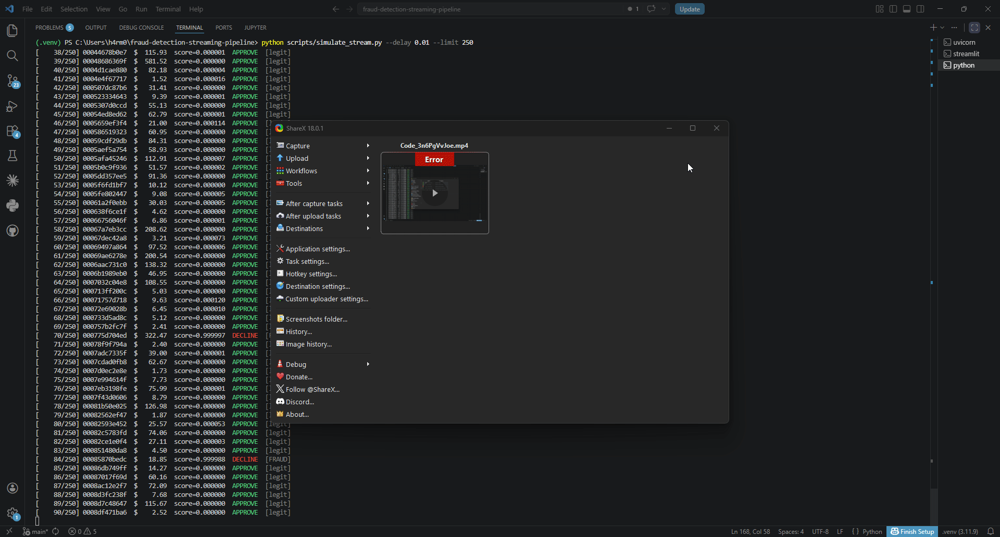
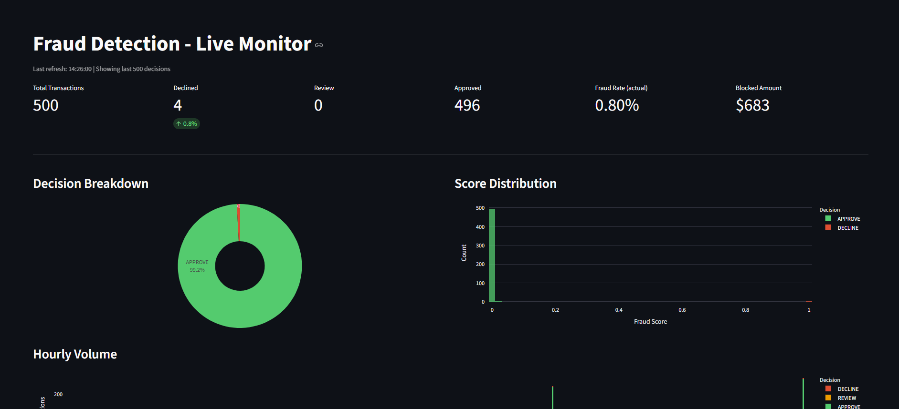

# Fraud Detector Pipeline

A real-time credit card fraud detection system built with LightGBM, FastAPI, and Streamlit. Transactions are scored via a REST API, decisions are persisted to SQL Server, and a live dashboard monitors outcomes as they arrive.


## Features

- **LightGBM model** trained on behavioral and session-level features with 97.8% fraud recall and 0.007% false positive rate
- **FastAPI scoring endpoint** - single and batch transaction scoring
- **Three-tier decision engine** - APPROVE / REVIEW / DECLINE with configurable thresholds
- **SQL Server persistence** - decisions written to `fraud_decisions`; hourly rollup view for monitoring
- **Streamlit live dashboard** - auto-refreshing KPIs, score distribution, hourly volume, and recent decisions table
- **Stream simulator** - replays holdout data against the live API for end-to-end testing


---

## Project Structure

```
fraud-detection-streaming-pipeline/
├── api/
│   └── app.py                  # FastAPI scoring endpoints
├── dashboard/
│   └── streamlit_app.py        # Live monitoring dashboard
├── models/
│   ├── lgbm_fraud.pkl          # Trained model + label encoders
│   ├── feature_cols.json       # Ordered feature list
│   ├── threshold.json          # Optimal decision threshold
│   ├── eval_report.txt         # Holdout evaluation metrics
│   └── feature_importance.csv  # Feature gain scores
├── notebooks/
│   ├── fraud_eda.ipynb         # Exploratory data analysis
│   ├── model_training.ipynb    # Model training and evaluation
│   └── python_feats.ipynb      # Python feature engineering
├── scripts/
│   ├── config.py               # SQL Server + file path config
│   ├── score_transaction.py    # Core scoring logic
│   ├── train_model.py          # Model training script
│   └── sql/
│       └── feature_engineering.sql    # SQL-based feature queries
└── requirements.txt
```

---

## LiveStream


--

## Running the Pipeline

Start the FastAPI scoring server (`uvicorn api.app:app --host 0.0.0.0 --port 8000`), then run the stream simulator (`python scripts/simulate_stream.py`) which replays holdout transactions against the `/score` endpoint one at a time. Each scored decision is written to SQL Server. The Streamlit dashboard (`streamlit run dashboard/streamlit_app.py`) polls the database on a configurable interval and displays live KPIs, score distribution, hourly volume, and a color-coded decisions table.



---

## Scoring Logic

Each transaction is scored by [scripts/score_transaction.py](scripts/score_transaction.py):

1. Load the LightGBM model, label encoders, feature list, and threshold from `models/`
2. Encode categorical columns and build the feature vector
3. Predict fraud probability with `model.predict_proba`
4. Apply thresholds:
   - `score >= threshold` → **DECLINE**
   - `score >= 0.30` → **REVIEW**
   - otherwise → **APPROVE**
5. Write result to `fraud_decisions` in SQL Server

---

## Model Performance (Holdout)

| Metric        | Value     |
|---------------|-----------|
| ROC-AUC       | 1.0000    |
| PR-AUC        | 0.9958    |
| Precision     | 98.27%    |
| Recall        | 97.81%    |
| F1            | 98.04%    |
| Fraud caught  | 2,098 / 2,145 (97.8%) |
| Legit blocked | 37 / 553,574 (0.007%) |

**Decision threshold:** 0.8895 (DECLINE) | 0.30 (REVIEW)

**Top features by gain:** `AvgTxnAmtLast24h`, `BotLikelihoodScore`, `amt`, `SessionDurationSec`, `CheckoutTimeSec`

**Important Note on data and performance:** The base dataset is the [Kaggle Credit Card Fraud Detection](https://www.kaggle.com/datasets/kartik2112/fraud-detection) synthetic dataset, extended here with additional synthetic behavioral and third-party signal features. Because the data is generated from known statistical distributions rather than real transaction history, the near-perfect metrics above are expected - the signal is cleaner and more consistent than anything you would encounter in production. This project is intended as an illustration of architecture and technique, not a benchmark of real-world performance.

---

## Important Remarks

Productionizing this system against live transaction data would introduce challenges that synthetic data cannot replicate:

- **Concept drift** - fraud patterns shift continuously as attackers adapt. A model trained on last quarter's data degrades over time and requires scheduled retraining or online learning to stay current.
- **Adversarial patterns** - real fraudsters probe decision systems and adjust behavior to stay below detection thresholds. Synthetic data has no equivalent of this feedback loop between attacker and defender.
- **Label noise and delay** - ground truth labels in production arrive late (chargebacks can take weeks) and are noisy (not all fraud is reported; not all disputes are fraud). Training on clean, complete labels understates the difficulty of the labeling problem.
- **Class imbalance at scale** - real fraud rates are typically far below 1%, and the distribution of fraud types varies by merchant category, geography, and season in ways that are hard to capture synthetically.
- **Feedback loops** - internal review decisions feed back into labels, which feed back into training data. Without careful handling, this creates systematic bias: cases the model scores as low-risk are never reviewed, so their true fraud status remains unknown.


